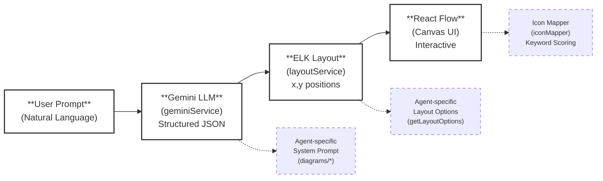

# NeuroFlow — AI-Powered Diagram Generation Engine

> **Natural language → Structured diagrams**, powered by Gemini LLM, ELK layout engine, and a multi-agent architecture.

NeuroFlow is a React + TypeScript application that converts natural language prompts into fully-rendered, interactive diagrams. Users describe a system, process, or concept in plain English, and NeuroFlow orchestrates an LLM call, auto-layout, and icon mapping to produce a professional diagram on an infinite canvas.

---

## Table of Contents

1. [System Overview](#system-overview)
2. [Core Pipeline: Prompt → Diagram](#core-pipeline-prompt--diagram)
   - [Step 1 — LLM Structured Output (Gemini Service)](#step-1--llm-structured-output-gemini-service)
   - [Step 2 — Spatial Layout (ELK Layout Engine)](#step-2--spatial-layout-elk-layout-engine)
   - [Step 3 — Icon Mapping](#step-3--icon-mapping)
   - [Step 4 — Canvas Rendering (React Flow)](#step-4--canvas-rendering-react-flow)
3. [Incremental Updates (Delta-Merge Architecture)](#incremental-updates-delta-merge-architecture)
4. [Undo / Redo History System](#undo--redo-history-system)
5. [Multi-Agent Architecture](#multi-agent-architecture)
   - [Agent Registry & Interface](#agent-registry--interface)
   - [Available Agents](#available-agents)
   - [How to Add a New Agent](#how-to-add-a-new-agent)
6. [Project Structure](#project-structure)
7. [Tech Stack](#tech-stack)
8. [Getting Started](#getting-started)

---

## System Overview



**Data flow summary:**

1. **User types a prompt** → the active agent's `systemInstruction` is injected as system prompt
2. **Gemini returns structured JSON** → `{ nodes[], edges[], explanation }` conforming to `RESPONSE_SCHEMA`
3. **Delta-merge** → new/modified nodes are merged into existing state (incremental updates)
4. **ELK layout** → positions all nodes spatially using the ELK.js graph layout library
5. **Icon mapping** → each node gets an icon via deterministic keyword scoring
6. **React Flow** renders the final interactive canvas

---

## Core Pipeline: Prompt → Diagram

### Step 1 — LLM Structured Output (Gemini Service)

**File:** [`src/services/geminiService.ts`](src/services/geminiService.ts)

The Gemini Service is the LLM integration layer. It calls the **Gemini Flash** model with:

- A **system instruction** from the active diagram agent (persona + rules)
- The **current diagram state** as JSON context
- The **conversation history** (multi-turn)
- A **structured JSON response schema** (`RESPONSE_SCHEMA`) enforced via `responseMimeType: "application/json"`

**Response Schema** — every LLM response conforms to:

```typescript
{
  nodes: [{
    id: string,          // Unique identifier (snake_case)
    label: string,       // Display name
    type: string,        // Node type (agent-specific)
    parentId?: string,   // For group/containment hierarchy
    description?: string,
    attributes?: [...],  // For ER/Class diagrams
    methods?: [...],     // For Class diagrams
    deleted?: boolean    // For incremental deletion
  }],
  edges: [{
    source: string,      // Source node ID
    target: string,      // Target node ID
    label?: string,      // Edge label (e.g., "1:N", "extends")
    deleted?: boolean    // For incremental deletion
  }],
  explanation: string    // AI summary of the generated diagram
}
```

**Key behaviors:**
- Exponential backoff retry (1s → 2s → 4s) on 429/503 errors
- Status updates via callback for loading UI
- Image analysis via Gemini Vision (`describeImage`) for image-to-diagram conversion

---

### Step 2 — Spatial Layout (ELK Layout Engine)

**Files:**
- [`src/services/layoutService.ts`](src/services/layoutService.ts) — Router
- [`src/services/layout/architectureLayout.ts`](src/services/layout/architectureLayout.ts) — Default layout
- [`src/services/layout/mindmapLayout.ts`](src/services/layout/mindmapLayout.ts) — Mind map layout

The layout service takes the logical schema (nodes + edges without positions) and computes `(x, y)` coordinates for every node using **ELK.js** (Eclipse Layout Kernel).

**Layout routing:**

| Agent Type | Layout Engine | ELK Algorithm |
|---|---|---|
| `mindmap` | `calculateMindMapLayout` | `mrtree` (bilateral split) |
| All others | `calculateArchitectureLayout` | `layered` (Sugiyama-style) |

**Architecture Layout (`architectureLayout.ts`)** does the following:

1. **Build ELK node map** — assigns dimensions via `diagramImpl.getNodeDimensions()`
2. **Build hierarchy** — resolves `parentId` into parent-child containment with 3-tier fuzzy matching:
   - Exact ID match → case-insensitive ID match → substring label match
3. **Apply per-agent layout options** — via `diagramImpl.getLayoutOptions()` (spacing, edge routing, etc.)
4. **Run ELK layout** — produces `(x, y)` positions for every node
5. **Process output** — converts ELK nodes into React Flow nodes, computes edge bend points using **LCA (Lowest Common Ancestor)** for correct cross-group edge offsets

**Mind Map Layout (`mindmapLayout.ts`)** implements a bilateral radial layout:
- Finds the `central` node
- Splits Level-1 children into left/right halves
- Runs ELK `mrtree` layout on each half independently
- Merges results centered on the central node

---

### Step 3 — Icon Mapping

**Files:**
- [`src/utils/iconMapper.tsx`](src/utils/iconMapper.tsx) — Main matching logic
- [`src/utils/iconRegistry.ts`](src/utils/iconRegistry.ts) — Searchable icon metadata
- [`src/utils/synonyms.ts`](src/utils/synonyms.ts) — Abbreviation/synonym expansion
- [`src/utils/cloudIcons.tsx`](src/utils/cloudIcons.tsx) — AWS cloud icons

The icon mapper is a **deterministic keyword-scoring algorithm** that assigns an icon to each node based on its label and type, without any LLM involvement.

**Algorithm (4 tiers):**

```
1. Manual Override     → User explicitly selected an icon? Use it.
2. Custom SVG Match    → Uploaded custom SVG? Match by name.
3. Keyword Scoring     → Deterministic search (see below).
4. Type Fallback       → Generic icon by node type (database→FaDatabase, etc.)
```

**Keyword Scoring (Tier 3) in detail:**

```
Input: node label + description → tokenize → expand synonyms → Set<string>

For each icon in COMBINED_REGISTRY:
  score = 0
  for each keyword in icon.keywords:
    if keyword ∈ expandedTokens → score += 10
  if score > 0:
    if icon.category ∈ CATEGORY_BOOST[nodeType] → score += 5
    if icon.category === nodeType → score += 5
    score += icon.priority  (higher = more specific)

Return icon with highest score.
```

**Synonym expansion** (`synonyms.ts`) maps abbreviations to full forms bidirectionally:
- `"k8s"` → `["kubernetes"]`
- `"db"` → `["database"]`
- `"aws"` → `["amazon", "amazon web services"]`

**Icon Registry** (`iconRegistry.ts`) contains 50+ icon entries, each with:
- `iconKey` — React icon component name (e.g., `"SiDocker"`)
- `keywords` — matching keywords (e.g., `["docker", "container", "containerization"]`)
- `category` — semantic grouping (`"devops"`, `"database"`, `"frontend"`, etc.)
- `priority` — specificity rank (10 = highly specific, 3 = generic fallback)

---

### Step 4 — Canvas Rendering (React Flow)

The final positioned nodes and styled edges are rendered on an interactive canvas powered by **@xyflow/react** (React Flow). Each node uses a `type: 'custom'` React Flow node that dispatches to different visual components based on the node's logical `data.type` (service, database, decision, entity, class, central, etc.).

---

## Incremental Updates (Delta-Merge Architecture)

**File:** [`src/hooks/useDiagramState.ts`](src/hooks/useDiagramState.ts) (lines 258–354)

NeuroFlow does **not** regenerate the entire diagram on every prompt. Instead, it uses a **delta-merge** strategy:

### How It Works

1. **LLM returns only deltas** — each agent's system prompt contains `COMMON_RULES` that instruct the LLM:
   > *"Return ONLY the NEW or MODIFIED nodes and edges. Do NOT return the entire diagram unless asked to regenerate."*

2. **Client-side merge** — `useDiagramState.handleSendMessage()` merges the delta into existing state:

   ```
   For each node in LLM response:
     if node.deleted === true  → remove from state
     if node.id exists         → UPDATE existing node (preserve position!)
     if node.id is new         → ADD to state at (0,0), layout will fix position

   For each edge in LLM response:
     if edge.deleted === true  → remove from state
     if (source, target) exists → UPDATE label
     if (source, target) is new → ADD with agent's edge style
   ```

3. **Re-layout with position preservation** — after merging, the full schema is re-laid out via ELK, but existing nodes retain their current `(x, y)` positions as hints to the layout engine (via ELK's `incremental` mode). This keeps the diagram stable while fitting new nodes into the layout.

### Why This Matters

- **Token efficiency** — the LLM only generates the diff, not the full diagram
- **Layout stability** — existing nodes don't jump around when a new node is added
- **Natural conversation** — users can iteratively refine diagrams: *"add a Redis cache between the API and database"*

### Delete Operations

Users can delete nodes/edges via natural language:
> *"Remove the Redis cache"* → LLM returns `{ id: "redis_cache", deleted: true }`

The merge logic detects `deleted: true` and splices the node/edge from state.

---

**Integration with `useDiagramState`:**
- `takeSnapshot({ nodes, edges })` is called **before** every state-mutating action:
  - LLM generation, canvas clear, edge connection, drag-and-drop, node deletion, icon change
- `handleUndo` / `handleRedo` restore the full `{ nodes, edges }` state

---

## Multi-Agent Architecture

### Agent Registry & Interface

**Files:**
- [`src/diagrams/index.ts`](src/diagrams/index.ts) — Agent registry
- [`src/diagrams/types.ts`](src/diagrams/types.ts) — `DiagramImplementation` interface

Every agent implements the `DiagramImplementation` interface:

```typescript
interface DiagramImplementation {
  type: AgentType;              // 'architect' | 'analyst' | 'mindmap' | ...
  label: string;                // UI display name
  welcomeMessage: string;       // Chat message on agent switch
  systemInstruction: string;    // LLM system prompt (persona + rules)
  getLayoutOptions: (node, hasPositions) => Record<string, string>;  // ELK options
  getNodeDimensions: (node) => { width, height };                    // Node sizing
  getEdgeStyle: () => { pathType, strokeWidth, stroke };             // Edge visual
  placeholderText: string;      // Input placeholder
  loadingText: string;          // Loading indicator text
}
```

The **agent registry** maps `AgentType` → `DiagramImplementation`:

```typescript
const registry: Record<AgentType, DiagramImplementation> = {
  architect: architectureDiagram,
  analyst:   flowchartDiagram,
  mindmap:   mindmapDiagram,
  database:  databaseDiagram,
  class:     classDiagram,
  c4:        c4Diagram
};
```

### Available Agents

| Agent | Type Key | Purpose | Node Types | Layout |
|---|---|---|---|---|
| **System Architect** | `architect` | Cloud infrastructure & topologies | `service`, `database`, `client`, `queue`, `external`, `group` | ELK layered, orthogonal edges |
| **Flow Chart Generator** | `analyst` | Business processes & algorithms | `start`, `end`, `process`, `decision`, `group` | ELK layered, bezier edges |
| **Mind Map Generator** | `mindmap` | Hierarchical brainstorming | `central`, `topic`, `subtopic`, `note` | ELK mrtree (bilateral) |
| **ER Diagram Generator** | `database` | Database schemas | `entity` (with `attributes`) | ELK layered, bezier edges |
| **Class Diagram Generator** | `class` | UML class structures | `class` (with `attributes` + `methods`) | ELK layered, bezier edges |
| **C4 Model Generator** | `c4` | C4 architecture (Context/Container/Component) | `person`, `system`, `container`, `component`, `frame`, `database` | ELK layered, bezier edges |

### How the Agent System Works

Every agent shares the **same pipeline** but customizes 4 things:

1. **System Prompt** — defines the persona and rules (what node types to use, how to structure the diagram)
2. **Layout Options** — ELK algorithm, spacing, edge routing style
3. **Node Dimensions** — how to size each node type
4. **Edge Style** — bezier vs. step, stroke width, color

All agents inherit `COMMON_RULES` — the incremental update instructions that enable delta-merge.