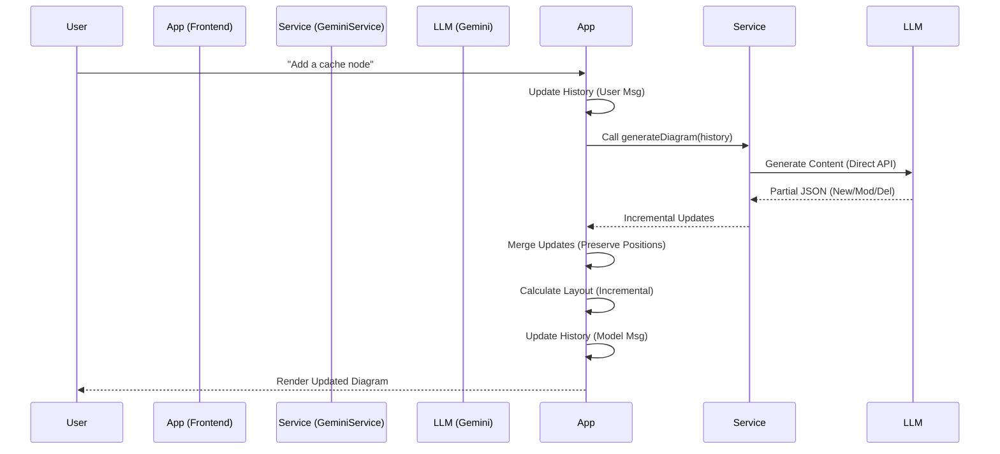

# Chat Thread & Request Architecture

This document outlines how the chat thread works, how requests are processed, and how "history" is managed in the NeuroFlow application.

## Overview: "History-Based Incremental Updates"

NeuroFlow uses a **History-Based** approach combined with **Incremental Updates**.

*   **Full Conversation History:** The application sends the full conversation history (User and Model messages) to the LLM with each request. This allows the LLM to maintain context of previous decisions and references.
*   **Incremental JSON Responses:** The LLM is instructed to return *only* the **changes** (new, modified, or deleted nodes/edges) rather than the entire diagram schema.
*   **Frontend Merging:** The frontend intelligently merges these partial updates into the existing diagram state, preserving manual layout adjustments.

## Detailed Request Flow

### 1. User Interaction (Frontend)
*   **File:** `src/hooks/useDiagramState.ts`
*   **Action:** User types a message (e.g., "Add a database") and hits Send.
*   **State:** The app appends the user's message to the local `history` state.

### 2. Service Layer (Frontend)
*   **File:** `src/services/geminiService.ts`
*   **Function:** `generateDiagram(history, agent, apiKey)`
*   **Direct API Call:** The service initializes the `GoogleGenAI` client with the user's API key and sends the request directly to Google's servers.
*   **System Instruction:** It selects the appropriate "Persona" (System Instruction) based on the active agent. The instruction explicitly tells the LLM:
    *   Return ONLY new or modified items.
    *   Mark items with `"deleted": true` to remove them.
    *   Maintain existing IDs.

### 3. LLM Processing (Gemini)
*   **Model:** `gemini-flash-latest`
*   **Context:** The LLM receives the System Instruction and the full Conversation History.
*   **Reasoning:**
    1.  It reviews the history to understand the current state of the diagram.
    2.  It interprets the latest `USER REQUEST`.
    3.  It generates a JSON structure containing *only* the necessary updates.
*   **Output:** A JSON object containing a list of `nodes` and `edges` to add/update/delete.

### 4. Response Handling (Frontend)
*   **File:** `src/hooks/useDiagramState.ts`
*   **Action:**
    1.  Receives the partial JSON schema.
    2.  **Merging Logic:**
        *   **Add:** If a node/edge ID is new, it is added to the state.
        *   **Update:** If an ID exists, its data is updated, but its **position is preserved**.
        *   **Delete:** If `deleted: true`, the item is removed from the state.
    3.  **Incremental Layout (ELK):**
        *   The merged schema is passed to `src/services/layoutService.ts`.
        *   **Standard:** Uses `layered` algorithm with `interactive: true` to respect existing positions.
        *   **Mind Map:** Temporarily switches from `mrtree` to `layered` (with compact spacing) to allow incremental updates without resetting the tree layout.
    4.  **Rendering:** The React Flow canvas is updated.
    5.  **History Update:** The LLM's JSON response is added to the `history` state so it remembers what it just did.

## Why this approach?

| Feature | State-as-Context (Old) | History-Based (New) |
| :--- | :--- | :--- |
| **Context** | Limited to current diagram state. | Full conversation context (reasoning, intent). |
| **Efficiency** | Sends full diagram, receives full diagram. | Sends history, receives **only changes**. |
| **Layout** | Hard to preserve manual edits (full redraw). | **Preserves manual edits** via merging & incremental layout. |
| **Deletions** | Implicit (missing items removed). | **Explicit** (`deleted: true` flag). |

## Visual Data Flow

