# Test Suite Report

## Overview
This document details the verification of the webapp's diagram generation and rendering capabilities. We tested 5 diagram types using two methods:
1.  **Intermediate Presentation**: Rendering from a pre-defined JSON schema (Golden Test).
2.  **LLM Prompt**: Generating diagrams from natural language prompts via the UI.

## Test Data
The test data used for the Intermediate Presentation tests can be found in `testData.ts`.

## Results

### 1. System Architecture
**Status**: ✅ PASS

#### Intermediate Presentation
**JSON Schema:**
```json
{
    "nodes": [
        { "id": "client", "label": "Client App", "type": "client" },
        { "id": "api_gateway", "label": "API Gateway", "type": "service" },
        { "id": "auth_service", "label": "Auth Service", "type": "service" },
        { "id": "user_db", "label": "User DB", "type": "database" },
        { "id": "payment_service", "label": "Payment Service", "type": "service" },
        { "id": "external_bank", "label": "Bank API", "type": "external" }
    ],
    "edges": [
        { "source": "client", "target": "api_gateway", "label": "HTTPS" },
        { "source": "api_gateway", "target": "auth_service", "label": "gRPC" },
        { "source": "auth_service", "target": "user_db", "label": "SQL" },
        { "source": "api_gateway", "target": "payment_service", "label": "gRPC" },
        { "source": "payment_service", "target": "external_bank", "label": "REST" }
    ]
}
```
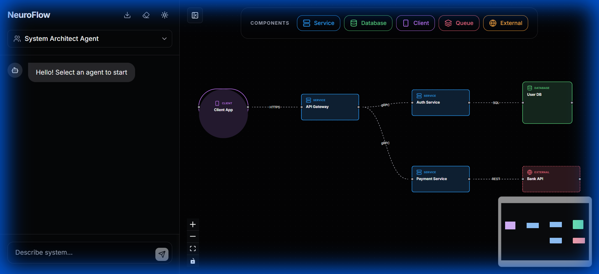

#### LLM Prompt ("Create a simple microservices architecture...")
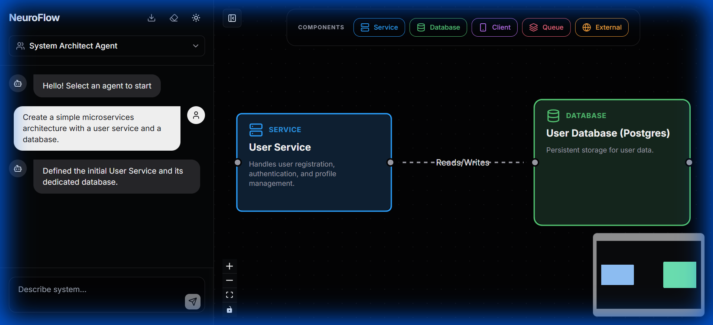

---

### 2. Flowchart
**Status**: ✅ PASS

#### Intermediate Presentation
**JSON Schema:**
```json
{
    "nodes": [
        { "id": "start", "label": "Start", "type": "start" },
        { "id": "check_login", "label": "Is Logged In?", "type": "decision" },
        { "id": "show_dashboard", "label": "Show Dashboard", "type": "process" },
        { "id": "show_login", "label": "Show Login Page", "type": "process" },
        { "id": "end", "label": "End", "type": "end" }
    ],
    "edges": [
        { "source": "start", "target": "check_login" },
        { "source": "check_login", "target": "show_dashboard", "label": "Yes" },
        { "source": "check_login", "target": "show_login", "label": "No" },
        { "source": "show_dashboard", "target": "end" },
        { "source": "show_login", "target": "end" }
    ]
}
```
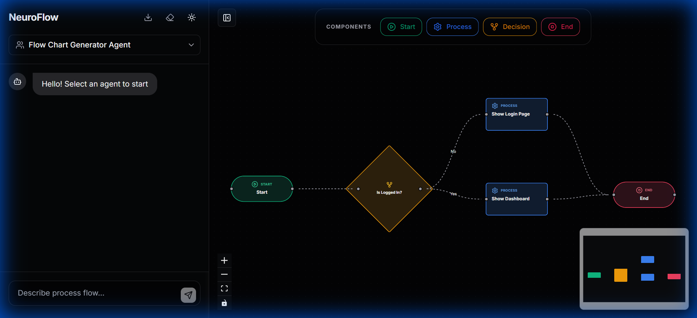

#### LLM Prompt ("Create a flowchart for a login process")
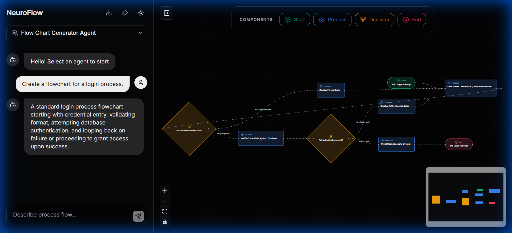

---

### 3. Mind Map
**Status**: ✅ PASS

#### Intermediate Presentation
**JSON Schema:**
```json
{
    "nodes": [
        { "id": "root", "label": "Project Goals", "type": "central" },
        { "id": "dev", "label": "Development", "type": "topic", "parentId": "root" },
        { "id": "marketing", "label": "Marketing", "type": "topic", "parentId": "root" },
        { "id": "frontend", "label": "Frontend", "type": "subtopic", "parentId": "dev" },
        { "id": "backend", "label": "Backend", "type": "subtopic", "parentId": "dev" },
        { "id": "social", "label": "Social Media", "type": "subtopic", "parentId": "marketing" },
        { "id": "ads", "label": "Ads", "type": "subtopic", "parentId": "marketing" }
    ],
    "edges": [
        { "source": "root", "target": "dev" },
        { "source": "root", "target": "marketing" },
        { "source": "dev", "target": "frontend" },
        { "source": "dev", "target": "backend" },
        { "source": "marketing", "target": "social" },
        { "source": "marketing", "target": "ads" }
    ]
}
```
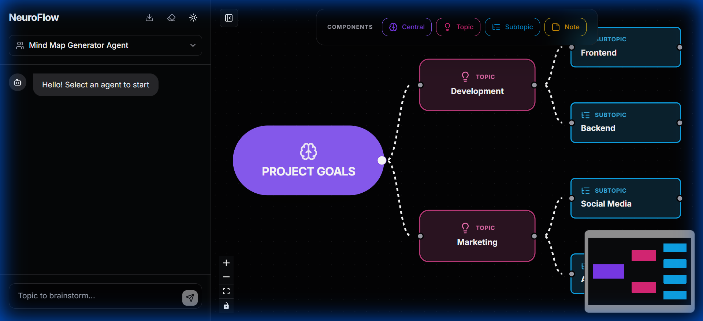

#### LLM Prompt ("Create a mind map for a marketing plan")
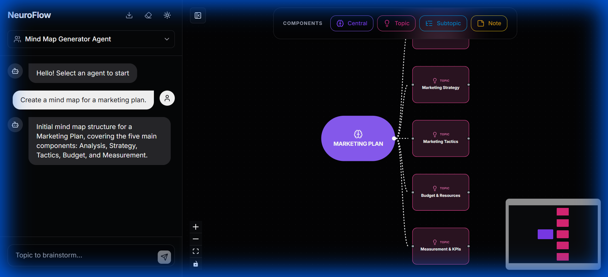

---

### 4. Database Schema
**Status**: ✅ PASS

#### Intermediate Presentation
**JSON Schema:**
```json
{
    "nodes": [
        {
            "id": "users",
            "label": "users",
            "type": "entity",
            "attributes": [
                { "name": "id", "dataType": "uuid", "isPK": true },
                { "name": "email", "dataType": "varchar", "isPK": false },
                { "name": "password_hash", "dataType": "varchar", "isPK": false }
            ]
        },
        {
            "id": "posts",
            "label": "posts",
            "type": "entity",
            "attributes": [
                { "name": "id", "dataType": "uuid", "isPK": true },
                { "name": "user_id", "dataType": "uuid", "isFK": true },
                { "name": "content", "dataType": "text", "isPK": false }
            ]
        }
    ],
    "edges": [
        { "source": "users", "target": "posts", "label": "1:N" }
    ]
}
```
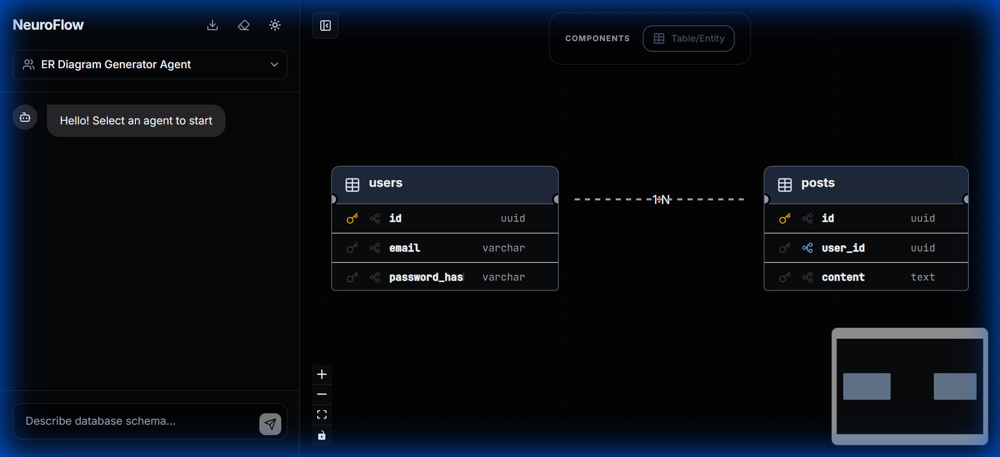

#### LLM Prompt ("Add a posts table")
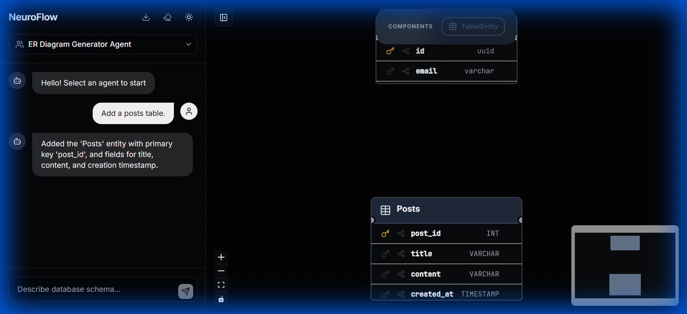

---

### 5. Class Diagram
**Status**: ✅ PASS

#### Intermediate Presentation
**JSON Schema:**
```json
{
    "nodes": [
        {
            "id": "animal",
            "label": "Animal",
            "type": "class",
            "attributes": [{ "name": "name", "dataType": "string", "visibility": "+" }],
            "methods": [{ "name": "makeSound", "returnType": "void", "visibility": "+" }]
        },
        {
            "id": "dog",
            "label": "Dog",
            "type": "class",
            "attributes": [{ "name": "breed", "dataType": "string", "visibility": "-" }],
            "methods": [{ "name": "fetch", "returnType": "void", "visibility": "+" }]
        }
    ],
    "edges": [
        { "source": "dog", "target": "animal", "label": "extends" }
    ]
}
```
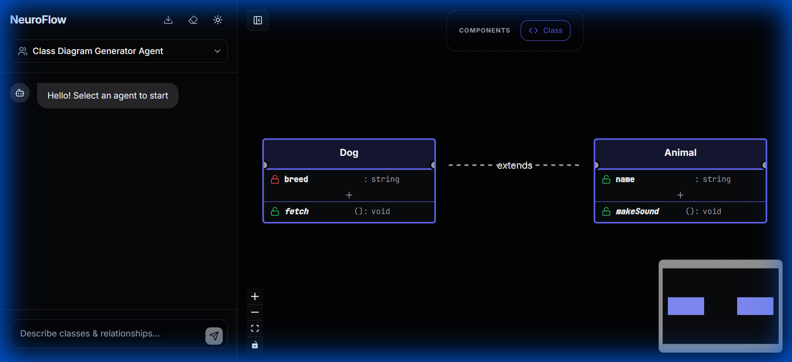

## How to Run Tests manually
1. Open the browser console.
2. Use `window.renderTestDiagram(schema, agentType)` to render any schema.
3. Example:
   ```javascript
## Incremental Updates (Edit via Prompt)
We verified that users can edit diagrams using natural language prompts without resetting the entire layout.

### 1. System Architecture
**Initial State**: Client, Server
**Prompt**: "Connect Client to Server with HTTPS."
**Result**: Connection added.
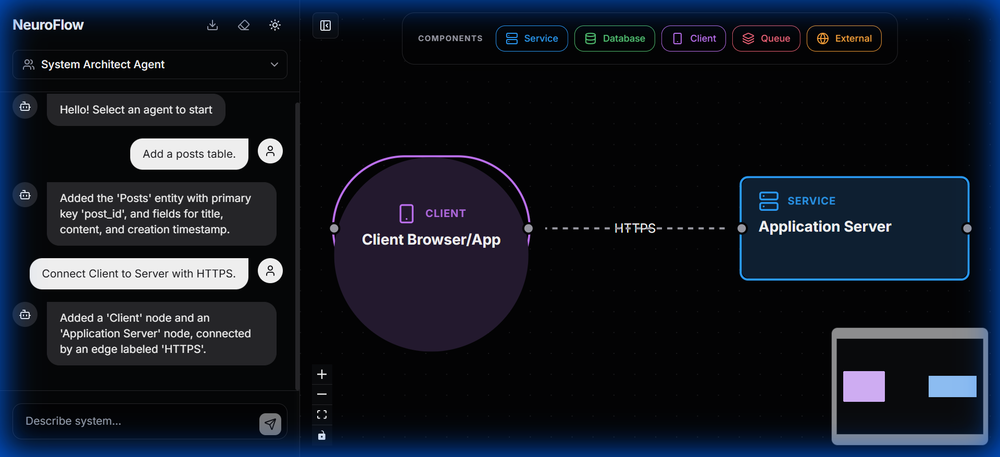

### 2. Flowchart
**Initial State**: Start -> Check?
**Prompt**: "If yes, go to Process A."
**Result**: 'Process A' node and 'Yes' edge added.
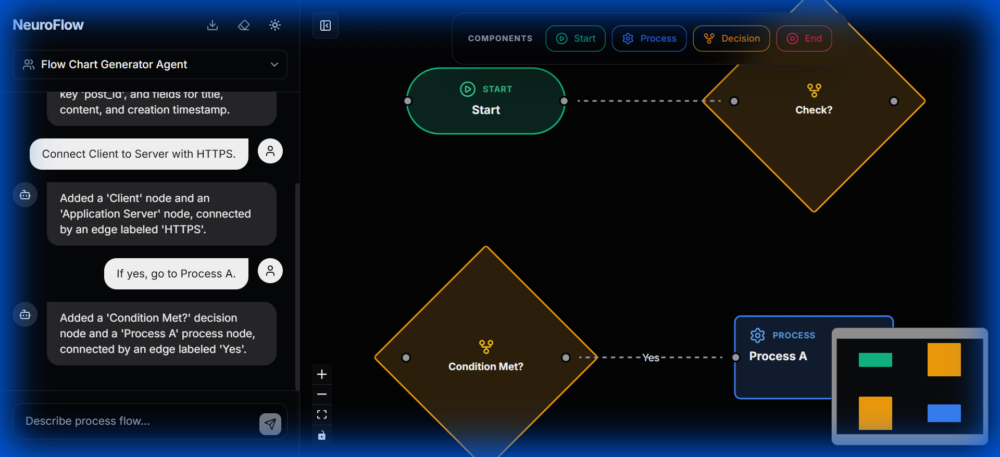

### 3. Mind Map
**Initial State**: Main Topic -> Subtopic 1
**Prompt**: "Add Subtopic 2 to Main Topic."
**Result**: 'Subtopic 2' added.
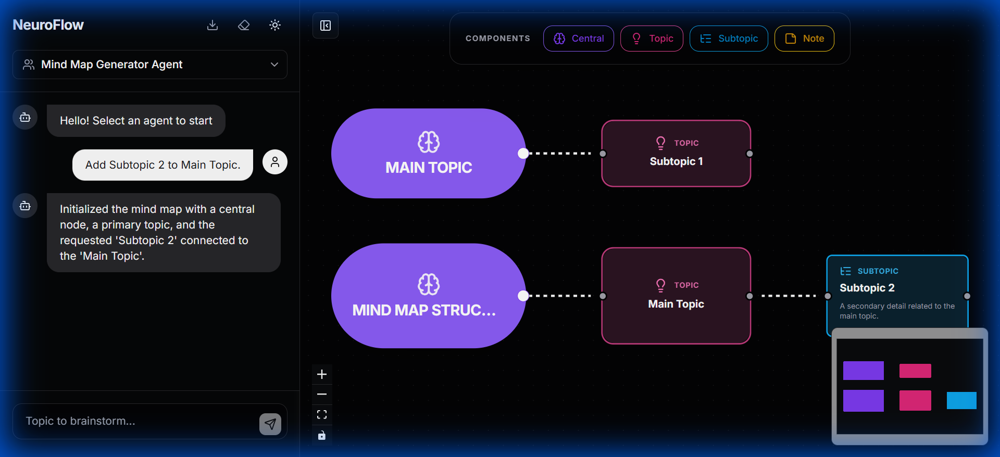

### 4. Database Schema
**Initial State**: Users table (id)
**Prompt**: "Add an email column to users table."
**Result**: 'email' column added to 'users' table.
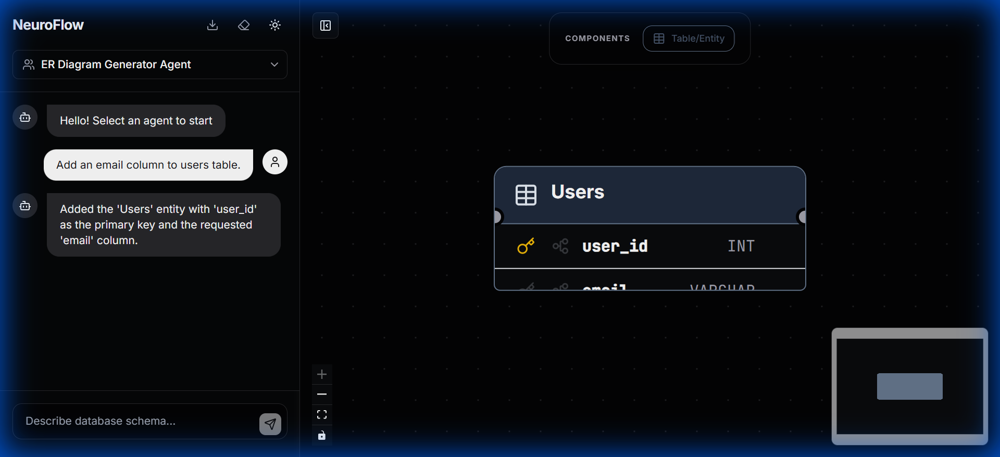

### 5. Class Diagram
**Initial State**: User class (name)
**Prompt**: "Add a login method to User class."
**Result**: 'login' method added to 'User' class.
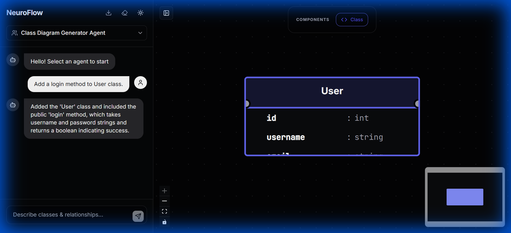
